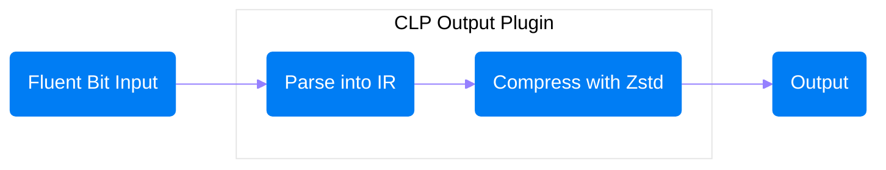

# Fluent Bit output plugins for CLP

Repository contains Fluent Bit output plugins that store records in CLP's compressed IR
(intermediate representation) format. More details on IR can be found in this
[Uber Engineering Blog][1].

The general flow is as follows:



#### Fluent Bit Input

Fluent Bit can collect application logs from >40 different [sources][2]. Common sources include
tailing log files and other Fluent Bit instances.

#### CLP Output Plugin

Output plugin recieves logs from Fluent Bit and parses them into [CLP IR][1]. CLP IR consists of a
timestamp, a list of variable values, and the log type. IR is then compressed with [Zstd][3] in
default mode without dictionaries.

#### Output

Compressed IR output is sent to plugin output (currently only AWS S3 is supported). CLP can directly
ingest compressed IR output and convert into archives for efficient storage and search.

### Usage

Each plugin has its own README to help get started. Currently, we only have a
[AWS S3 plugin](plugins/out_clp_s3/README.md), but please submit an issue if you need to send IR to
another output.

### Linting

1. Install golangci-lint:

```shell
curl -sSfL https://raw.githubusercontent.com/golangci/golangci-lint/master/install.sh | \
  sh -s -- -b $(go env GOPATH)/bin v1.59.0
```

2. Run with `golangci-lint run`

[1]: https://www.uber.com/en-US/blog/reducing-logging-cost-by-two-orders-of-magnitude-using-clp
[2]: https://docs.fluentbit.io/manual/pipeline/inputs
[3]: https://github.com/facebook/zstd
