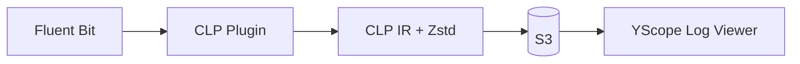

# Fluent Bit CLP Plugins

[Fluent Bit][fluent-bit] output plugins that compress logs using [CLP][clp-blog] for efficient
storage and search on AWS S3.

## Table of Contents

- [Overview](#overview)
- [Which Plugin Should I Use?](#which-plugin-should-i-use)
- [Quick Start](#quick-start)
- [Pre-built Binaries](#pre-built-binaries)
- [Documentation](#documentation)
- [Development](#development)

## Overview



**[CLP][clp-blog]** (Compressed Log Processor) is a log compression tool that achieves 10-100x
better compression than gzip while enabling fast search. These plugins compress logs into CLP's
Intermediate Representation (IR) format with [Zstd][zstd] compression, then upload to S3.

Use [YScope Log Viewer][log-viewer] to view compressed logs directly in the browser, or ingest
into CLP for search at scale.

## Which Plugin Should I Use?

| Plugin | Upload Trigger | Best For |
|--------|---------------|----------|
| **[out_clp_s3_v2](plugins/out_clp_s3_v2/README.md)** | Time-based (per log level) | Kubernetes, latency-sensitive workloads |
| **[out_clp_s3](plugins/out_clp_s3/README.md)** | Size-based (MB threshold) | Batch processing, size optimization |

**Recommended: Start with `out_clp_s3_v2`** - it offers more control over upload latency and
works well with Kubernetes deployments.

### out_clp_s3_v2 (Recommended)

Time-based flushing with per-log-level control:
- ERROR logs uploaded in seconds, DEBUG logs batched for minutes
- Dual-timer strategy (hard + soft) prevents upload storms
- Designed for Kubernetes (sidecar and DaemonSet patterns)
- MinIO compatible for local development

### out_clp_s3

Size-based uploads with crash recovery:
- Upload when buffer reaches size threshold (default 16 MB)
- Disk buffering with crash recovery
- IAM role assumption for cross-account access
- Single key extraction from log records

## Quick Start

### Using Pre-built Binaries (Kubernetes)

```shell
# Create k3d cluster with plugin mounted
k3d cluster create yscope --servers 1 --agents 1 \
  -v $(pwd)/pre-built:/fluent-bit/plugins \
  -p 9000:30000@agent:0 -p 9001:30001@agent:0

# Deploy MinIO and Fluent Bit
cd plugins/out_clp_s3_v2/k8s
kubectl apply -f minio.yaml
kubectl apply -f logs-bucket-creation.yaml -f aws-credentials.yaml
kubectl apply -f fluent-bit-sidecar.yaml -f fluent-bit-sidecar-config.yaml -f aws-credentials.yaml
```

See [out_clp_s3_v2 Kubernetes guide](plugins/out_clp_s3_v2/README.md#kubernetes-deployment) for
detailed setup.

### Using Docker

```shell
# out_clp_s3_v2
cd plugins/out_clp_s3_v2
docker build -t fluent-bit-clp-v2 -f Dockerfile ../../
docker run -v ~/.aws/credentials:/root/.aws/credentials fluent-bit-clp-v2

# out_clp_s3
cd plugins/out_clp_s3
docker build -t fluent-bit-clp -f Dockerfile ../../
docker run -v ~/.aws/credentials:/root/.aws/credentials fluent-bit-clp
```

## Pre-built Binaries

Linux AMD64 binaries are available in `pre-built/`:

| File | Plugin |
|------|--------|
| `out_clp_s3_v2_linux_amd64.so` | Time-based plugin (recommended) |
| `out_clp_s3_linux_amd64.so` | Size-based plugin |

## Documentation

| Document | Description |
|----------|-------------|
| [out_clp_s3_v2 README](plugins/out_clp_s3_v2/README.md) | Configuration, flush strategy, Kubernetes deployment |
| [out_clp_s3 README](plugins/out_clp_s3/README.md) | Configuration, disk buffering, crash recovery |
| [Kubernetes Quick Reference](plugins/out_clp_s3_v2/k8s/README.md) | kubectl commands for local k8s setup |

## Development

### Building

```shell
# Install Task (build tool)
npm install -g @go-task/cli

# Build plugins
task build
```

### Linting

```shell
# Install prerequisites
# - Task: https://taskfile.dev/installation/
# - uv: https://docs.astral.sh/uv/getting-started/installation/

# Run checks
task lint:check

# Auto-fix
task lint:fix
```

[clp-blog]: https://www.uber.com/blog/reducing-logging-cost-by-two-orders-of-magnitude-using-clp
[fluent-bit]: https://fluentbit.io/
[log-viewer]: https://github.com/y-scope/yscope-log-viewer
[zstd]: https://facebook.github.io/zstd/
