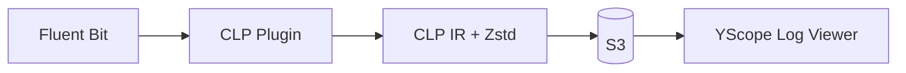

# Fluent Bit CLP Plugins

[Fluent Bit][fluent-bit] output plugins that compress logs using [CLP][clp-blog] for efficient
storage and search on S3.

## Overview



**[CLP][clp-blog]** (Compressed Log Processor) achieves 10-100x better compression than gzip while
enabling fast search. These plugins compress logs into CLP's Intermediate Representation (IR)
format with [Zstd][zstd] compression, then upload to S3.

View compressed logs directly in the browser with [YScope Log Viewer][log-viewer], or ingest into
CLP for search at scale.

## Plugins

Two plugins with different log delivery strategies:

| Plugin | Strategy | Description |
|--------|----------|-------------|
| **[out_clp_s3_v2](plugins/out_clp_s3_v2/README.md)** | Continuous sync | Compressed logs continuously synced to S3; sync frequency tunable to balance freshness vs cost |
| **[out_clp_s3](plugins/out_clp_s3/README.md)** | Batch upload | Logs buffered locally until size threshold reached, then uploaded as batch |

### out_clp_s3_v2 — Continuous Sync

Log rotation is delegated to the log appender. The plugin continuously syncs compressed log files
to S3.

- Higher severity logs (e.g., ERROR) trigger faster sync of the entire log file
- Dual-timer strategy (hard + soft deadlines) prevents upload storms
- Designed for Kubernetes (sidecar and DaemonSet patterns)

### out_clp_s3 — Batch Upload

Logs are buffered locally and uploaded when a size threshold is reached.

- Upload when buffer reaches size threshold (default 16 MB)
- Disk buffering with crash recovery
- IAM role assumption for cross-account access

## Quick Start

The fastest way to try locally with Docker Compose:

```shell
git clone --recursive https://github.com/y-scope/fluent-bit-clp.git
cd fluent-bit-clp

# Choose one:
cd plugins/out_clp_s3_v2/examples/docker-compose  # Continuous sync
cd plugins/out_clp_s3/examples/docker-compose     # Batch upload

docker compose up
```

This starts MinIO (S3-compatible storage), Fluent Bit with the plugin, and a log generator.
View logs at http://localhost:9001 (minioadmin/minioadmin).

## Installation

### Docker Images

Pre-built Fluent Bit images with CLP plugins:

```shell
docker pull ghcr.io/y-scope/fluent-bit-clp-s3-v2:latest  # Continuous sync
docker pull ghcr.io/y-scope/fluent-bit-clp-s3:latest     # Batch upload
```

Images are tagged with `latest` (main branch), branch names, and commit SHAs.

### Pre-built Binaries

Standalone `.so` plugin files available from [GitHub Releases](../../releases):

| File | Architecture |
|------|--------------|
| `out_clp_s3_v2_linux_amd64.so` | x86_64 |
| `out_clp_s3_v2_linux_arm64.so` | ARM64 |
| `out_clp_s3_linux_amd64.so` | x86_64 |
| `out_clp_s3_linux_arm64.so` | ARM64 |

Also available as zip from [Actions → build](../../actions/workflows/build.yaml).

## Kubernetes

See [Kubernetes Examples](plugins/out_clp_s3_v2/examples/kubernetes/README.md) for deployment guides:

| Directory | Description |
|-----------|-------------|
| `quickstart/` | Pre-built image with bundled .so plugin |
| `init-container/` | Base Fluent Bit image + plugin downloaded at startup |
| `production/` | Production-ready manifests for EKS, GKE, AKS |

Both **Sidecar** (per-pod) and **DaemonSet** (per-node) patterns are supported.

## Documentation

| Document | Description |
|----------|-------------|
| [out_clp_s3_v2 README](plugins/out_clp_s3_v2/README.md) | Configuration and flush strategy |
| [out_clp_s3 README](plugins/out_clp_s3/README.md) | Configuration and disk buffering |
| [Contributing Guide](CONTRIBUTING.md) | Development setup, code structure, testing |

## Development

### Quick Start

```shell
# Clone with submodules
git clone --recursive https://github.com/y-scope/fluent-bit-clp.git
cd fluent-bit-clp

# Download clp-ffi-go native libraries
bash third-party/clp-ffi-go/scripts/download-libs.sh

# Build plugins
task build

# Run tests
go test ./...
```

### Prerequisites

- Go 1.24+
- [Task](https://taskfile.dev/installation/)

### Linting

```shell
task lint:check  # Run checks
task lint:fix    # Auto-fix
```

See [CONTRIBUTING.md](CONTRIBUTING.md) for detailed development guide, code structure, and testing instructions.

[clp-blog]: https://www.uber.com/blog/reducing-logging-cost-by-two-orders-of-magnitude-using-clp
[fluent-bit]: https://fluentbit.io/
[log-viewer]: https://github.com/y-scope/yscope-log-viewer
[zstd]: https://facebook.github.io/zstd/
