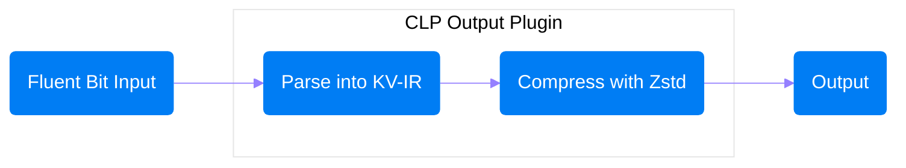

# Fluent Bit output plugins for CLP

Repository contains Fluent Bit output plugins that store records in CLP's compressed
[KV-IR (key-value intermediate representation)][1] format. A blog on Uber's use of CLP IR can be
found [here][2].

The general flow is as follows:


```mermaid
%%{init: {
  'theme': 'base',
    'themeVariables': {
      'primaryColor': '#0066cc',
      'primaryTextColor': '#fff',
      'primaryBorderColor': 'transparent',
      'lineColor': '#9580ff',
      'secondaryColor': '#9580ff',
      'tertiaryColor': '#fff'
      }
    }
}%%
flowchart LR
    A(Fluent Bit Input) --> B
    subgraph CLP Output Plugin
    B(Parse into KV-IR) --> C(Compress with Zstd)
    end
    C --> D(Output)
    classDef format fill:#007DF4,color:white
    class A,B,C,D format
```

#### Fluent Bit Input

Fluent Bit can collect application logs from >40 different [sources][3]. Common sources include
tailing log files and other Fluent Bit instances.

#### CLP Output Plugin

Output plugin receives logs from Fluent Bit and parses them into [CLP KV-IR][1]. KV-IR is then
compressed with [Zstd][4] in default mode without dictionaries.

#### Output

Compressed KV-IR output is sent to plugin output (currently only AWS S3 is supported).
CLP-JSON can directly ingest compressed KV-IR output and convert into archives for efficient
storage and search.

### Usage

Each plugin has its own README to help get started. Currently, we only have an
[AWS S3 plugin](plugins/out_clp_s3/README.md), but please submit an issue if you need to send
KV-IR to another output.

### Linting

1. Install golangci-lint:

```shell
curl -sSfL https://golangci-lint.run/install.sh | \
  sh -s -- -b $(go env GOPATH)/bin v2.8.0
```

2. Run with `golangci-lint run`

[1]: https://docs.yscope.com/clp/main/dev-docs/design-kv-ir-streams/index.html
[2]: https://www.uber.com/en-US/blog/reducing-logging-cost-by-two-orders-of-magnitude-using-clp
[3]: https://docs.fluentbit.io/manual/pipeline/inputs
[4]: https://github.com/facebook/zstd
