```mermaid
flowchart LR
    Input[/"Fluent Bit"/] --> Decode

    subgraph Plugin["out_clp_s3"]
        Decode["Decode"] --> Extract["Extract"] --> IR["CLP IR"] --> Zstd["Zstd"]
        Zstd --> Buffer[("Buffer")]
        Buffer --> Check{"size ≥ threshold?"}
        Check -->|No| Buffer
    end

    Check -->|Yes| S3[("S3")]
    Recovery["Recovery"] -.->|on startup| S3
```

# out_clp_s3

Size-based Fluent Bit output plugin that uploads logs to AWS S3 in CLP's compressed format.
Uploads are triggered when the buffer reaches a size threshold.

> **See also:** [Main README](../../README.md) for plugin comparison and CLP overview |
> [out_clp_s3_v2](../out_clp_s3_v2/README.md) for time-based alternative with per-log-level control

## Table of Contents

- [Quick Start](#quick-start)
- [Configuration](#configuration)
  - [Plugin Options](#plugin-options)
  - [AWS Credentials](#aws-credentials)
- [How It Works](#how-it-works)
  - [Architecture](#architecture)
  - [Disk Buffering](#disk-buffering)
  - [S3 Object Naming](#s3-object-naming)
- [Deployment](#deployment)
  - [Docker](#docker)
  - [Local Setup](#local-setup)

---

## Quick Start

### Docker Compose (Easiest)

```shell
cd examples/docker-compose
docker compose up
```

This starts MinIO, Fluent Bit, and a log generator. View logs at http://localhost:9001.

### Minimal Configuration

```ini
# fluent-bit.conf
[OUTPUT]
    name      out_clp_s3
    match     *
    s3_bucket my-logs-bucket
```

### Run with Docker

```shell
# Using pre-built image from GitHub Container Registry
docker run -v ~/.aws/credentials:/root/.aws/credentials:ro \
  ghcr.io/y-scope/fluent-bit-clp-s3:latest

# Or build locally
docker build -t fluent-bit-clp -f Dockerfile ../../
docker run -v ~/.aws/credentials:/root/.aws/credentials:ro fluent-bit-clp
```

### Run Locally

```shell
fluent-bit -c fluent-bit.conf
```

---

## Configuration

### Plugin Options

| Option | Description | Default |
|--------|-------------|---------|
| `s3_bucket` | S3 bucket name **(required)** | - |
| `s3_region` | AWS region | `us-east-1` |
| `s3_bucket_prefix` | Key prefix in bucket | `logs/` |
| `role_arn` | IAM role to assume (for cross-account) | - |
| `upload_size_mb` | Upload threshold in MB (compressed size) | `16` |
| `use_disk_buffer` | Buffer on disk before upload | `true` |
| `disk_buffer_path` | Buffer directory | `tmp/out_clp_s3/` |
| `use_single_key` | Extract single field vs full record | `true` |
| `single_key` | Field to extract when `use_single_key=true` | `log` |
| `allow_missing_key` | Fallback to full record if key missing | `true` |
| `time_zone` | Timezone for non-unix timestamps | `America/Toronto` |
| `id` | Plugin instance ID | random UUID |

#### Single Key Extraction

When `use_single_key=true` (default), the plugin extracts just the specified field instead of the
entire Fluent Bit record. This is recommended for better CLP compression ratios.

```ini
# Extract only the "log" field (default)
use_single_key  true
single_key      log

# Or use full JSON record
use_single_key  false
```

### AWS Credentials

Credentials are loaded via the [AWS SDK default credential chain][aws-creds]:

1. Environment variables (`AWS_ACCESS_KEY_ID`, `AWS_SECRET_ACCESS_KEY`)
2. Shared credentials file (`~/.aws/credentials`)
3. ECS task IAM role
4. EC2 instance IAM role

**For cross-account access**, use `role_arn`:
```ini
[OUTPUT]
    name      out_clp_s3
    match     *
    s3_bucket other-account-bucket
    role_arn  arn:aws:iam::123456789012:role/S3AccessRole
```

[aws-creds]: https://docs.aws.amazon.com/sdk-for-go/v1/developer-guide/configuring-sdk.html#specifying-credentials

---

## How It Works

### Architecture



**Pipeline:**
1. Receive log records from Fluent Bit
2. Extract message (single key or full JSON record)
3. Encode to [CLP IR format](https://docs.yscope.com/clp/main/dev-guide/components-core/log-storage.html), compress with Zstd
4. Buffer on disk until size threshold reached (default: 16 MB compressed)
5. Upload to S3, reset buffer
6. On crash: recover and upload buffered logs on next startup

### Disk Buffering

| Mode | Behavior | Trade-off |
|------|----------|-----------|
| `use_disk_buffer=true` (default) | Accumulate until `upload_size_mb` | Better compression, fewer S3 calls, crash recovery |
| `use_disk_buffer=false` | Upload each Fluent Bit chunk immediately | Lower latency, more S3 calls |

**Crash Recovery:** With disk buffering enabled, any logs buffered before a crash are automatically
uploaded when the plugin restarts.

### S3 Object Naming

Objects are named using this pattern:
```
<s3_bucket_prefix>/<FLUENT_BIT_TAG>_<INDEX>_<UPLOAD_TIME>_<ID>.zst
```

**Example:** `logs/myapp_0_2024-01-15T10:30:00Z_abc123.zst`

| Component | Description |
|-----------|-------------|
| `s3_bucket_prefix` | Configurable prefix (default: `logs/`) |
| `FLUENT_BIT_TAG` | Tag from input plugin |
| `INDEX` | Upload counter (resets on restart) |
| `UPLOAD_TIME` | ISO 8601 timestamp |
| `ID` | Plugin instance ID |

Objects are tagged with `fluentBitTag=<TAG>` for filtering in S3.

---

## Deployment

### Docker

#### Pre-built Image

```shell
docker run \
  -v ~/.aws/credentials:/root/.aws/credentials:ro \
  -v /var/log/myapp:/logs:ro \
  ghcr.io/y-scope/fluent-bit-clp-s3:latest
```

#### Build from Source

```shell
# From repository root
docker build -t fluent-bit-clp -f plugins/out_clp_s3/Dockerfile .

docker run \
  -v ~/.aws/credentials:/root/.aws/credentials:ro \
  fluent-bit-clp
```

#### With MinIO (Local Development)

```shell
docker run \
  -e AWS_ACCESS_KEY_ID=minioadmin \
  -e AWS_SECRET_ACCESS_KEY=minioadmin \
  -e AWS_ENDPOINT_URL=http://host.docker.internal:9000 \
  fluent-bit-clp
```

#### Docker Compose

The easiest way to test locally:

```shell
cd examples/docker-compose
docker compose up
```

See [examples/docker-compose/README.md](examples/docker-compose/README.md) for details.

### Local Setup

#### Prerequisites

- Go 1.24+
- [Task](https://taskfile.dev/) (task runner)
- Fluent Bit
- AWS credentials configured

#### Build and Run

```shell
# Initialize submodules (if not cloned with --recursive)
git submodule update --init --recursive

# Download native libraries
bash third-party/clp-ffi-go/scripts/download-libs.sh

# Build plugin
task build:s3

# Update plugin path in fluent-bit.conf, then run
fluent-bit -c fluent-bit.conf
```

#### Example Configuration

```ini
[SERVICE]
    flush        1
    daemon       off
    log_level    info

[INPUT]
    name         tail
    path         /var/log/myapp/*.log
    parser       json
    tag          myapp

[OUTPUT]
    name              out_clp_s3
    match             *
    s3_bucket         my-logs-bucket
    s3_region         us-east-1
    s3_bucket_prefix  logs/
    upload_size_mb    16
    use_disk_buffer   true
```
