# out_clp_s3

Size-based Fluent Bit output plugin that uploads logs to AWS S3 in CLP's compressed format.
Uploads are triggered when the buffer reaches a size threshold.

> **See also:** [Main README](../../README.md) for plugin comparison and CLP overview |
> [out_clp_s3_v2](../out_clp_s3_v2/README.md) for time-based alternative

## Table of Contents

- [Architecture](#architecture)
- [Getting Started](#getting-started)
- [Configuration](#configuration)
- [AWS Credentials](#aws-credentials)
- [S3 Object Naming](#s3-object-naming)

## Architecture

```mermaid
flowchart LR
    Input[/"Fluent Bit"/] --> Decode

    subgraph Plugin["out_clp_s3"]
        Decode["Decode"] --> Extract["Extract"] --> IR["CLP IR"] --> Zstd["Zstd"]
        Zstd --> Buffer[("Buffer")]
        Buffer --> Check{"size ≥ threshold?"}
        Check -->|No| Buffer
    end

    Check -->|Yes| S3[("S3")]
    Recovery["Recovery"] -.->|on startup| S3
```



**How it works:**
1. Receive log records from Fluent Bit
2. Extract message (single key or full JSON record)
3. Encode to CLP IR format, compress with Zstd
4. Buffer on disk until size threshold reached (default: 16 MB)
5. Upload to S3, reset buffer
6. On crash: recover and upload buffered logs on restart

## Getting Started

### Prerequisites

- AWS credentials configured ([see below](#aws-credentials))
- Docker or local Go + Fluent Bit installation

### Docker

```shell
docker build ../../ -t fluent-bit-clp -f Dockerfile
docker run -v ~/.aws/credentials:/root/.aws/credentials --rm fluent-bit-clp
```

### Local Setup

```shell
# Install Go and Fluent Bit, then:
go mod download
task build

# Update plugin path in fluent-bit.conf, then:
fluent-bit -c fluent-bit.conf
```

### Minimal Configuration

```ini
[OUTPUT]
    name      out_clp_s3
    match     *
    s3_bucket myBucket
```

## Configuration

| Key | Description | Default |
|-----|-------------|---------|
| `s3_bucket` | S3 bucket name (required) | - |
| `s3_region` | AWS region | `us-east-1` |
| `s3_bucket_prefix` | Key prefix in bucket | `logs/` |
| `role_arn` | IAM role to assume | - |
| `upload_size_mb` | Upload threshold (compressed size) | `16` |
| `use_disk_buffer` | Buffer on disk before upload | `true` |
| `disk_buffer_path` | Buffer directory | `tmp/out_clp_s3/` |
| `use_single_key` | Extract single field vs full record | `true` |
| `single_key` | Field to extract | `log` |
| `allow_missing_key` | Fallback to full record if key missing | `true` |
| `time_zone` | Timezone for non-unix timestamps | `America/Toronto` |
| `id` | Plugin instance ID | random UUID |

### Single Key Extraction

When `use_single_key=true`, the plugin extracts just the specified field (default: `log`)
instead of the entire Fluent Bit record. Recommended for better CLP compression.

### Disk Buffering

With `use_disk_buffer=true`:
- Logs accumulate until reaching `upload_size_mb`
- Better compression ratio, fewer S3 API calls
- **Crash recovery**: buffered logs uploaded on restart

With `use_disk_buffer=false`:
- Each Fluent Bit chunk uploaded immediately
- Lower latency, more S3 API calls

## AWS Credentials

Credentials are loaded in this order:
1. Environment variables (`AWS_ACCESS_KEY_ID`, `AWS_SECRET_ACCESS_KEY`)
2. Shared credentials file (`~/.aws/credentials`)
3. ECS task IAM role
4. EC2 instance IAM role

For cross-account access, use `role_arn`:
```ini
role_arn arn:aws:iam::123456789012:role/S3AccessRole
```

## S3 Object Naming

Objects are named:
```
<s3_bucket_prefix>/<FLUENT_BIT_TAG>_<INDEX>_<UPLOAD_TIME>_<ID>.zst
```

Example: `logs/myapp_0_2024-01-15T10:30:00Z_abc123.zst`

- `INDEX` increments per upload (resets on restart)
- Objects are tagged with `fluentBitTag=<TAG>` for filtering
