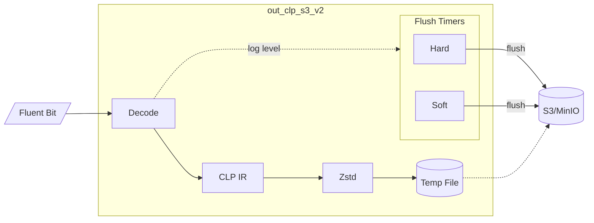

# out_clp_s3_v2

Time-based Fluent Bit output plugin that uploads logs to AWS S3 or MinIO in CLP's compressed
format. Features per-log-level flush control—upload ERROR logs in seconds while batching
DEBUG logs for minutes.

> **See also:** [Main README](../../README.md) for plugin comparison and CLP overview |
> [out_clp_s3](../out_clp_s3/README.md) for size-based alternative

## Table of Contents

- [Quick Start](#quick-start)
- [Configuration](#configuration)
  - [Plugin Options](#plugin-options)
  - [Environment Variables](#environment-variables)
  - [AWS Credentials](#aws-credentials)
  - [Flush Timing Presets](#flush-timing-presets)
- [How It Works](#how-it-works)
  - [Architecture](#architecture)
  - [Dual-Timer Flush Strategy](#dual-timer-flush-strategy)
  - [File Mapping](#file-mapping)
- [Deployment](#deployment)
  - [Docker](#docker)
  - [Kubernetes](#kubernetes)

---

## Quick Start

### Docker Compose (Easiest)

```shell
cd examples/docker-compose
docker compose up
```

This starts MinIO, Fluent Bit, and a log generator. View logs at http://localhost:9001.

### Minimal Configuration

```yaml
# fluent-bit.yaml
plugins:
  - /path/to/out_clp_s3_v2.so

pipeline:
  inputs:
    - name: tail
      path: /logs/*.jsonl
      parser: json

  outputs:
    - name: out_clp_s3_v2
      match: "*"
      log_bucket: my-logs-bucket
```

### Run with Docker

```shell
# Using pre-built image from GitHub Container Registry
docker run -v ~/.aws/credentials:/root/.aws/credentials \
  -v /var/log:/logs:ro \
  -e AWS_REGION=us-east-1 \
  ghcr.io/y-scope/fluent-bit-clp-s3-v2:latest

# Or build locally
docker build -t fluent-bit-clp-v2 -f Dockerfile ../../
docker run -v ~/.aws/credentials:/root/.aws/credentials \
  -e AWS_REGION=us-east-1 \
  fluent-bit-clp-v2
```

### Run Locally

```shell
fluent-bit --config fluent-bit.yaml
```

---

## Configuration

### Plugin Options

| Option | Description | Default |
|--------|-------------|---------|
| `log_bucket` | S3 bucket name **(required)** | - |
| `log_level_key` | JSON field containing log level | `level` |
| `flush_hard_delta_<level>` | Maximum time before upload (see [Dual-Timer Strategy](#dual-timer-flush-strategy)) | `3s` |
| `flush_soft_delta_<level>` | Idle time before upload (see [Dual-Timer Strategy](#dual-timer-flush-strategy)) | `3s` |

**Levels:** `trace`, `debug`, `info`, `warn`, `error`, `fatal`

#### Log Level Detection

The plugin recognizes these values in the `log_level_key` field:

| Level | Recognized Values |
|-------|-------------------|
| TRACE | `trace`, `TRACE` |
| DEBUG | `debug`, `DEBUG`, `D` |
| INFO | `info`, `INFO`, `I` |
| WARN | `warn`, `warning`, `WARN`, `WARNING`, `W` |
| ERROR | `error`, `critical`, `ERROR`, `CRITICAL`, `E` |
| FATAL | `fatal`, `wtf`, `FATAL` |

Unrecognized or missing levels default to INFO.

### Environment Variables

| Variable | Description | Default |
|----------|-------------|---------|
| `AWS_REGION` | AWS region for S3 | `us-west-1` |
| `AWS_ENDPOINT_URL` | Custom S3 endpoint (for MinIO, LocalStack) | - |

### AWS Credentials

Credentials are loaded via the [AWS SDK default credential chain][aws-creds]:

1. Environment variables (`AWS_ACCESS_KEY_ID`, `AWS_SECRET_ACCESS_KEY`)
2. Shared credentials file (`~/.aws/credentials`)
3. ECS task IAM role
4. EC2 instance IAM role

**For Kubernetes:** Mount credentials as a secret—see [examples/kubernetes/aws-credentials.yaml](examples/kubernetes/aws-credentials.yaml).

[aws-creds]: https://docs.aws.amazon.com/sdk-for-go/v1/developer-guide/configuring-sdk.html#specifying-credentials

### Flush Timing Presets

Choose based on how quickly you need to see errors:

| Scenario | ERROR latency | DEBUG/INFO latency | Use case |
|----------|---------------|-------------------|----------|
| **Batch Jobs** | 3 min | 10 min | Check logs 5-10 min after job completion |
| **Near Real-Time** | 15 sec | 5 min | Fast error visibility, efficient batching |
| **Error-Prone** | 30 sec | 2 min | Rate-limit uploads during error storms |
| **Development** | 3 sec | 10 sec | Fast feedback loop |

<details>
<summary><b>Batch/Scheduled Jobs</b> — click to expand</summary>

```yaml
outputs:
  - name: out_clp_s3_v2
    match: "*"
    log_bucket: logs
    flush_hard_delta_debug: 10m
    flush_hard_delta_info:  10m
    flush_hard_delta_warn:  5m
    flush_hard_delta_error: 3m
    flush_hard_delta_fatal: 1m
    flush_soft_delta_debug: 5m
    flush_soft_delta_info:  5m
    flush_soft_delta_warn:  2m
    flush_soft_delta_error: 1m
    flush_soft_delta_fatal: 30s
```
</details>

<details>
<summary><b>Near Real-Time Error Monitoring</b> — click to expand</summary>

```yaml
outputs:
  - name: out_clp_s3_v2
    match: "*"
    log_bucket: logs
    flush_hard_delta_debug: 5m
    flush_hard_delta_info:  5m
    flush_hard_delta_warn:  1m
    flush_hard_delta_error: 15s
    flush_hard_delta_fatal: 5s
    flush_soft_delta_debug: 3m
    flush_soft_delta_info:  2m
    flush_soft_delta_warn:  30s
    flush_soft_delta_error: 10s
    flush_soft_delta_fatal: 3s
```
</details>

<details>
<summary><b>Error-Prone Systems</b> (rate limiting) — click to expand</summary>

Hard timer acts as rate limiter: max 2 uploads/min during error floods.

```yaml
outputs:
  - name: out_clp_s3_v2
    match: "*"
    log_bucket: logs
    flush_hard_delta_debug: 2m
    flush_hard_delta_info:  2m
    flush_hard_delta_warn:  45s
    flush_hard_delta_error: 30s
    flush_hard_delta_fatal: 15s
    flush_soft_delta_debug: 3m
    flush_soft_delta_info:  3m
    flush_soft_delta_warn:  1m
    flush_soft_delta_error: 45s
    flush_soft_delta_fatal: 30s
```
</details>

<details>
<summary><b>Development/Debugging</b> — click to expand</summary>

```yaml
outputs:
  - name: out_clp_s3_v2
    match: "*"
    log_bucket: logs
    flush_hard_delta_debug: 10s
    flush_hard_delta_info:  10s
    flush_hard_delta_warn:  5s
    flush_hard_delta_error: 3s
    flush_hard_delta_fatal: 1s
    flush_soft_delta_debug: 5s
    flush_soft_delta_info:  5s
    flush_soft_delta_warn:  3s
    flush_soft_delta_error: 2s
    flush_soft_delta_fatal: 1s
```
</details>

---

## How It Works

### Architecture



**Pipeline:**
1. Receive log records from Fluent Bit
2. Encode to [CLP IR format](https://docs.yscope.com/clp/main/dev-guide/components-core/log-storage.html), compress with Zstd
3. Buffer compressed data to a temp file
4. Extract log level from each record → update flush timers
5. When a timer fires → upload temp file to S3

### Dual-Timer Flush Strategy

This plugin uses two cooperating timers to balance **cost efficiency** and **error visibility**.

| Timer | Behavior | Purpose |
|-------|----------|---------|
| **Soft** | Resets on every new log | Batches logs during activity; uploads during quiet periods |
| **Hard** | Only moves *earlier*, never resets | Guarantees maximum latency; prevents infinite delays during log floods |

**Why two timers?**

```
Scenario 1: Normal operation (INFO logs, 30s timeouts)
  INFO → INFO → INFO → [30s quiet] → UPLOAD
  Result: Efficient batching during quiet periods

Scenario 2: Error during flood (ERROR=1s, INFO=30s)
  INFO → INFO → ERROR → INFO → INFO → UPLOAD at ERROR+1s
  Result: ERROR's deadline honored despite ongoing INFO flood
```

**Key insight:** The hard timer only moves *earlier*. One ERROR log among thousands of INFO logs still triggers a fast upload at the ERROR's deadline.

### File Mapping

Each source file maps to **one S3 object**:

```
Source path                   →  S3 object
─────────────────────────────────────────────────────────
/logs/app/server.log         →  s3://bucket/app/server.log.clp.zst
/logs/app/server.log         →  s3://bucket/app/server.log.clp.zst  (overwrites previous)
/logs/app/server.log.2024-01 →  s3://bucket/app/server.log.2024-01.clp.zst  (new object)
```

**Key points:**
- Same source path = same S3 key (overwrites on each upload)
- Different source paths = different S3 keys
- The plugin does not split files—control size via log rotation

#### Controlling Upload Size

Configure your application's log appender to rotate files by size or time:

```
❌ Single file:    /logs/app.log                      → grows forever, overwrites same key
✅ Rotated files:  /logs/app.log.2024-01-15T10:30:00  → separate S3 objects per rotation
```

**Recommendation:** Rotate around 256 MB uncompressed. CLP typically achieves 10-100x compression,
so uploaded files will be much smaller. Avoid rotating too frequently to prevent many small S3 objects.

---

## Deployment

### Docker

#### Pre-built Image

```shell
docker run \
  -v ~/.aws/credentials:/root/.aws/credentials:ro \
  -v /var/log/myapp:/logs:ro \
  -e AWS_REGION=us-east-1 \
  ghcr.io/y-scope/fluent-bit-clp-s3-v2:latest
```

#### Build from Source

```shell
# From repository root
docker build -t fluent-bit-clp-v2 -f plugins/out_clp_s3_v2/Dockerfile .

docker run \
  -v ~/.aws/credentials:/root/.aws/credentials:ro \
  -e AWS_REGION=us-east-1 \
  fluent-bit-clp-v2
```

#### Cross-Platform Builds

Build for `amd64` or `arm64` regardless of host architecture using the build script:

```shell
cd plugins/out_clp_s3_v2

# Build both architectures
./scripts/build-docker.sh

# Build single architecture (loads into local docker)
./scripts/build-docker.sh --amd64
./scripts/build-docker.sh --arm64

# Build and push multi-arch manifest to registry
IMAGE_NAME=myregistry/fluent-bit-clp-s3-v2 ./scripts/build-docker.sh --push
```

#### With MinIO (Local Development)

```shell
docker run \
  -e AWS_REGION=us-east-1 \
  -e AWS_ENDPOINT_URL=http://host.docker.internal:9000 \
  -e AWS_ACCESS_KEY_ID=minioadmin \
  -e AWS_SECRET_ACCESS_KEY=minioadmin \
  fluent-bit-clp-v2
```

#### Docker Compose

The easiest way to test locally:

```shell
cd examples/docker-compose
docker compose up
```

See [examples/docker-compose/README.md](examples/docker-compose/README.md) for details.

### Kubernetes

Two deployment patterns are supported:

| Pattern | Description |
|---------|-------------|
| [**Sidecar**](examples/kubernetes/sidecar/) | Fluent Bit runs alongside your app, reading from shared volume |
| [**DaemonSet**](examples/kubernetes/daemonset/) | One Fluent Bit per node, collecting from `/var/log` |

#### Quick Start with k3d

```shell
# Create cluster with plugin mounted
k3d cluster create yscope --servers 1 --agents 1 \
  -v /path/to/plugins:/fluent-bit/plugins \
  -p 9000:30000@agent:0 \
  -p 9001:30001@agent:0

# Deploy infrastructure and Fluent Bit
cd examples/kubernetes
kubectl apply -f minio.yaml -f aws-credentials.yaml
kubectl wait --for=condition=Ready pod/minio --timeout=60s
kubectl apply -f logs-bucket-creation.yaml
kubectl apply -f sidecar/fluent-bit-sidecar.yaml -f sidecar/fluent-bit-sidecar-config.yaml
```

#### View Logs

Open [YScope Log Viewer](http://localhost:9000/log-viewer/index.html) and enter the S3 path:

```
s3://logs/app/test-001.jsonl.clp.zst
```

See [examples/kubernetes/README.md](examples/kubernetes/README.md) for complete setup and patterns.
