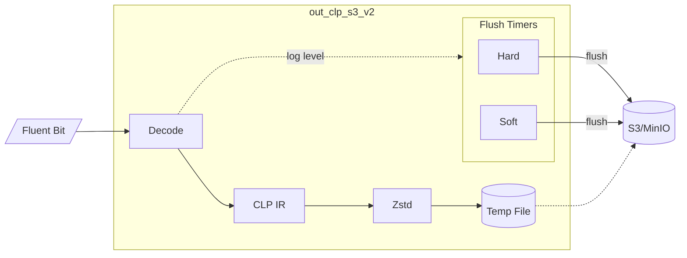
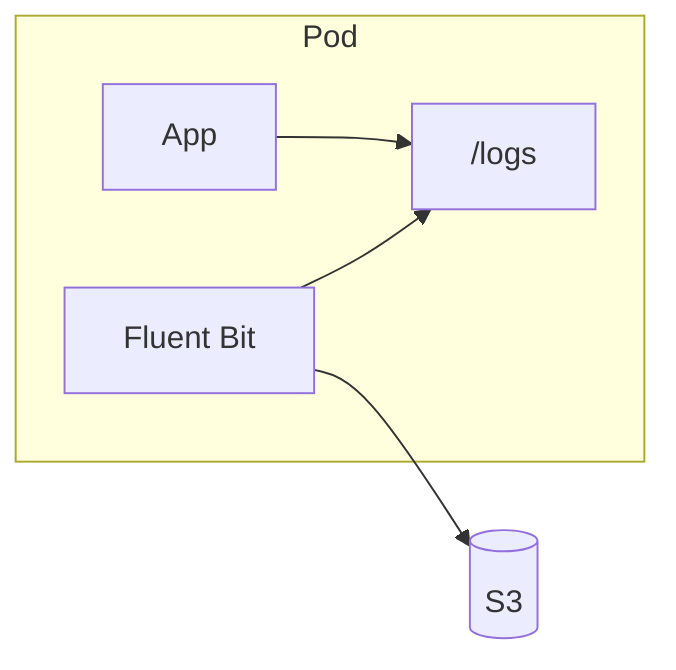
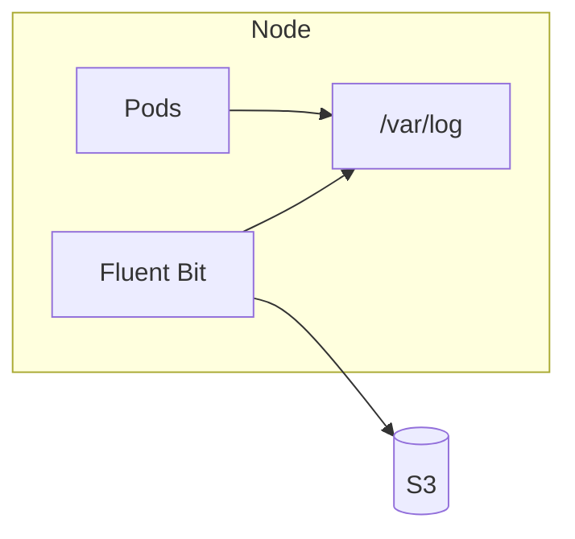

# out_clp_s3_v2

Time-based Fluent Bit output plugin that uploads logs to AWS S3 or MinIO in CLP's compressed
format. Features per-log-level flush control—upload ERROR logs in seconds while batching
DEBUG logs for minutes.

> **See also:** [Main README](../../README.md) for plugin comparison and CLP overview |
> [out_clp_s3](../out_clp_s3/README.md) for size-based alternative

## Table of Contents

- [Architecture](#architecture)
- [Dual-Timer Flush Strategy](#dual-timer-flush-strategy)
- [Configuration](#configuration)
- [Example Configurations](#example-configurations)
- [File Mapping](#file-mapping)
- [Kubernetes Deployment](#kubernetes-deployment)
- [Docker](#docker)

## Architecture



**How it works:**
1. Receive log records from Fluent Bit
2. Encode to CLP IR format, compress with Zstd to temp file
3. Extract log level from each record, update flush timers accordingly
4. When a timer fires → upload temp file to S3

## Dual-Timer Flush Strategy

This plugin uses two cooperating timers to balance **cost efficiency** and **error visibility**.

| Timer | Resets on new log? | Purpose |
|-------|-------------------|---------|
| **Soft** | Yes | Batches logs during activity; uploads during quiet periods |
| **Hard** | No (only moves earlier) | Guarantees max latency; prevents delays during floods |

**Why two timers?**

```
Normal operation (INFO logs only, 30s soft/hard):
  INFO → INFO → INFO → (quiet) → UPLOAD after 30s quiet
  Result: Efficient batching

Error during flood (ERROR=1s, INFO=30s):
  INFO → INFO → ERROR → INFO → INFO → UPLOAD at ERROR+1s
  Result: ERROR's deadline honored despite INFO flood
```

**Key insight:** The hard timer only moves *earlier*. One ERROR among thousands of INFO logs
still triggers a fast upload.

## Configuration

| Key | Description | Default |
|-----|-------------|---------|
| `log_bucket` | S3 bucket name (required) | - |
| `log_level_key` | JSON field containing log level | `level` |
| `flush_hard_delta_<level>` | Hard timeout for level | `3s` |
| `flush_soft_delta_<level>` | Soft timeout for level | `3s` |

Levels: `debug`, `info`, `warn`, `error`, `fatal`

### Environment Variables

| Variable | Description | Default |
|----------|-------------|---------|
| `AWS_REGION` | AWS region | `us-west-1` |
| `AWS_ENDPOINT_URL` | Custom endpoint (for MinIO) | - |

### Log Level Detection

| Level | Recognized Values |
|-------|-------------------|
| TRACE | `trace`, `TRACE` |
| DEBUG | `debug`, `DEBUG`, `D` |
| INFO | `info`, `INFO`, `I` |
| WARN | `warn`, `warning`, `WARN`, `WARNING`, `W` |
| ERROR | `error`, `critical`, `ERROR`, `CRITICAL`, `E` |
| FATAL | `fatal`, `wtf`, `FATAL` |

Unrecognized or missing levels default to INFO.

## Example Configurations

Choose based on how quickly you need to see errors:

| Scenario | ERROR | DEBUG/INFO | Use case |
|----------|-------|------------|----------|
| **Batch Jobs** | 3 min | 10 min | User checks 5-10 min after failure |
| **Near Real-Time** | 15 sec | 5 min | Fast error visibility |
| **Error-Prone** | 30 sec | 2 min | Prevent upload storms |
| **Development** | 3 sec | 10 sec | Fast feedback |

<details>
<summary><b>Batch/Scheduled Jobs</b></summary>

```yaml
outputs:
  - name: "out_clp_s3_v2"
    match: "*/*"
    log_bucket: "logs"
    flush_hard_delta_debug: "10m"
    flush_hard_delta_info:  "10m"
    flush_hard_delta_warn:  "5m"
    flush_hard_delta_error: "3m"
    flush_hard_delta_fatal: "1m"
    flush_soft_delta_debug: "5m"
    flush_soft_delta_info:  "5m"
    flush_soft_delta_warn:  "2m"
    flush_soft_delta_error: "1m"
    flush_soft_delta_fatal: "30s"
```
</details>

<details>
<summary><b>Near Real-Time Error Monitoring</b></summary>

```yaml
outputs:
  - name: "out_clp_s3_v2"
    match: "*/*"
    log_bucket: "logs"
    flush_hard_delta_debug: "5m"
    flush_hard_delta_info:  "5m"
    flush_hard_delta_warn:  "1m"
    flush_hard_delta_error: "15s"
    flush_hard_delta_fatal: "5s"
    flush_soft_delta_debug: "3m"
    flush_soft_delta_info:  "2m"
    flush_soft_delta_warn:  "30s"
    flush_soft_delta_error: "10s"
    flush_soft_delta_fatal: "3s"
```
</details>

<details>
<summary><b>Error-Prone Systems</b> (rate limiting)</summary>

Hard timer acts as rate limiter: max 2 uploads/min during error floods.

```yaml
outputs:
  - name: "out_clp_s3_v2"
    match: "*/*"
    log_bucket: "logs"
    flush_hard_delta_debug: "2m"
    flush_hard_delta_info:  "2m"
    flush_hard_delta_warn:  "45s"
    flush_hard_delta_error: "30s"
    flush_hard_delta_fatal: "15s"
    flush_soft_delta_debug: "3m"
    flush_soft_delta_info:  "3m"
    flush_soft_delta_warn:  "1m"
    flush_soft_delta_error: "45s"
    flush_soft_delta_fatal: "30s"
```
</details>

<details>
<summary><b>Development/Debugging</b></summary>

```yaml
outputs:
  - name: "out_clp_s3_v2"
    match: "*/*"
    log_bucket: "logs"
    flush_hard_delta_debug: "10s"
    flush_hard_delta_info:  "10s"
    flush_hard_delta_warn:  "5s"
    flush_hard_delta_error: "3s"
    flush_hard_delta_fatal: "1s"
    flush_soft_delta_debug: "5s"
    flush_soft_delta_info:  "5s"
    flush_soft_delta_warn:  "3s"
    flush_soft_delta_error: "2s"
    flush_soft_delta_fatal: "1s"
```
</details>

## File Mapping

Each local log file maps to **one S3 object**:

```
Local file                    →  S3 object
─────────────────────────────────────────────────
/logs/app/server.log         →  s3://bucket/app/server.log.clp.zst
/logs/app/server.log         →  s3://bucket/app/server.log.clp.zst  (overwrites)
/logs/app/server.log.2024-01 →  s3://bucket/app/server.log.2024-01.clp.zst  (new)
```

**Key points:**
- Same path = same S3 key (overwrites on each upload)
- Different paths = different S3 keys
- Plugin does not split files - control size via log rotation

### Controlling File Size

Configure your log appender to rotate files by size or time:

```
❌ Single file:     /logs/app.log                      → grows forever, overwrites same S3 key
✅ Rotated files:   /logs/app.log.2024-01-15T10:30:00  → separate S3 objects
```

**Recommendation:** Rotate around 256 MB. CLP's compression ratio is high, so the uploaded
file will be much smaller. Avoid rotating too frequently to prevent many small S3 objects.

## Kubernetes Deployment

Two deployment patterns are supported:

| Pattern | Use Case |
|---------|----------|
| **Sidecar** | Fluent Bit runs alongside your app in the same pod, collecting from a shared volume |
| **DaemonSet** | One Fluent Bit instance per node, collecting from `/var/log` for all pods on that node |

### Quick Start

```shell
# Create cluster with plugin mounted
k3d cluster create yscope --servers 1 --agents 1 \
  -v $(pwd)/../../pre-built:/fluent-bit/plugins \
  -p 9000:30000@agent:0 -p 9001:30001@agent:0

# Deploy stack
cd k8s
kubectl apply -f minio.yaml
kubectl apply -f logs-bucket-creation.yaml -f aws-credentials.yaml
kubectl apply -f fluent-bit-sidecar.yaml -f fluent-bit-sidecar-config.yaml -f aws-credentials.yaml
```

### Sidecar Pattern



```shell
kubectl apply -f fluent-bit-sidecar.yaml -f fluent-bit-sidecar-config.yaml -f aws-credentials.yaml

# Test
kubectl exec -it fluent-bit-sidecar -c ubuntu -- bash
echo '{"message": "test", "level": "error"}' > /logs/test.jsonl
```

### DaemonSet Pattern



```shell
kubectl create serviceaccount fluent-bit
kubectl apply -f fluent-bit-daemonset.yaml -f fluent-bit-daemonset-config.yaml -f aws-credentials.yaml
```

### Viewing Logs

Deploy [YScope Log Viewer][log-viewer] to view compressed logs directly in the browser:

```shell
kubectl apply -f yscope-log-viewer-deployment.yaml -f aws-credentials.yaml
```

Open http://localhost:9000/log-viewer/index.html and enter the S3 path to a log file
(e.g., `s3://logs/app/server.log.clp.zst`).

**Features:**
- Opens large compressed files quickly and lag-free
- Search with [KQL][kql] (Kusto Query Language) syntax
- Custom formatting (structured ↔ unstructured views)
- Filtering by log level, time range, etc.

**How it works:** The viewer is a static site hosted in an S3 bucket. It decompresses logs
client-side in the browser—no server infrastructure required. Used in production at Uber and
other companies.

**Integration:** Upstream systems can embed the viewer or generate permalinks with URL parameters:
```
http://localhost:9000/log-viewer/index.html?filePath=http://localhost:9000/logs/app.clp.zst
```
Parameters support pre-loading search queries, seeking to timestamps, and applying filters.

### Services

| Service | URL | Credentials |
|---------|-----|-------------|
| Log Viewer | http://localhost:9000/log-viewer/index.html | - |
| MinIO Console | http://localhost:9001 | minioadmin/minioadmin |
| MinIO API | http://localhost:9000 | - |

See [k8s/README.md](k8s/README.md) for complete command reference.

[kql]: https://learn.microsoft.com/en-us/kusto/query/
[log-viewer]: https://github.com/y-scope/yscope-log-viewer

## Docker

```shell
docker build -t fluent-bit-clp-v2 -f Dockerfile ../../
docker run -v ~/.aws/credentials:/root/.aws/credentials -e AWS_REGION=us-west-1 fluent-bit-clp-v2
```
